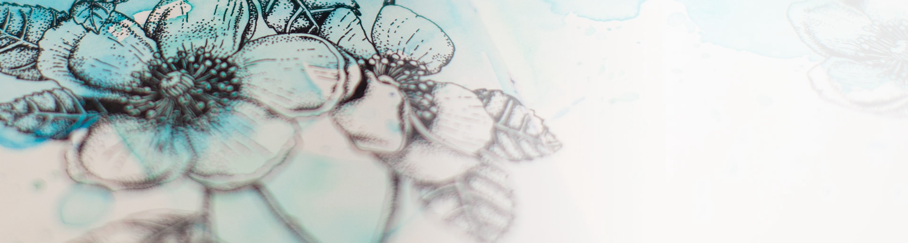

<!--horizontal divider(gradiant)-->

<!--h1 without bottom border-->

  <ul align="center">
    
<h1 style="display: inline-block">Hi 👋, I'm ourfor</h1>

  </ul>

<!--h2 without bottom border-->

  <ul align="center">
    
<h2 style="display: inline-block">Confusion is part of Programming</h2>

  </ul>

<!--Intro start-->
- 🔭 I’m currently working on **iOS/MacOS, React, Nodejs, SpringBoot, MySQL**

- 🌱 I’m currently learning **to put together ML Stack for Scalable Applications.**

- ☁️ I've keen interest in deep learning. So,I'm learning **Deep Learning**

- 📝 I regularly write articles on [ourfor's Blog](https://blog.ourfor.top/)

- 💬 Ask me about **react, Objective-C, nodejs, SpringBoot**

- 📫 Feel free to reach me out **ourfor@qq.com**

<!--Intro end-->

<!--- stats & Trophy (start) -->

  <!--- stats (start) -->
<table align="center">
<tr border="none">
<td width="50%" align="center">
  
  
    
   
</td>

<td width="50%" align="center">

  
  
  </td>
</tr>
</table>
<!--- stats (end) -->

<!--- trophy (start) -->

  

<!--- trophy (start) -->

        
<!--- stats (end) -->

<!--h1 without bottom border-->

  <ul align="center">
    
<h2 style="display: inline-block">Technologies That I Know👨🏻‍💻</h2>

  </ul>

<!--tech stack icons-->

  

<!-- Connect with me -->
<!--h2 without bottom border-->

  <ul align="center">
    
<h2 style="display: inline-block">Connect With Me🤝</h2>

  </ul>

<!--icons and links-->

<!--profile visit count-->

  

  

----------------------------------------------------------------------
Credit: [ourfor](https://github.com/ourfor)

Last Edited on: 8/3/2024
